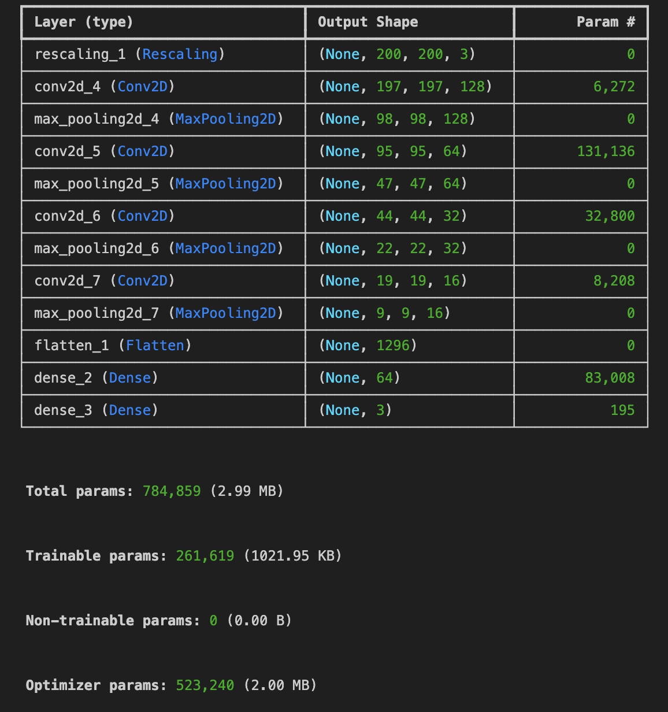

# Plan du portfolio

**1. IA & NLP :**  Model LSTM pour  la prédiction du type de sujet conernant les réclamations et pleintes à l'encontre de services financiers
 
**2. Application web streamlit de computer vision :** Réseau de neuronnes convultif et classification d'imageries médicales

**2. Projet  analyse de données en Python: système d'actionnariat chez Terre de Liens**

**2. Clustering, et Analyse en Composantes Principales (ACP) en Python :** Criminalité aux Etats-Unis

**3. Analyse factorielle des correspondances (AFC) en Python:** Elections présidentielles 2022, focus sur l'Ile de France

**4. Modélisation statistique en données de panel en R :** Application de la méthode des prix hédoniques au marché immobilier Lyonnais

**5. Modélisation statistique en données de panel en R :** Analyse des déterminants des salaires aux Etats-Unis

**6.Certifications data**
- SQL fundamentals
- Supervised Learning with Python
- Unsupervised Learning with Python
- Data preparation with Excel
- Data analytics with Excel

# 1. IA & NLP :  Model LSTM pour  la prédiction du type de sujet conernant les réclamations et pleintes à l'encontre de services financiers

## Présentation du problème : 

Dans ce projet de traitement automatique du langage naturel (NLP), j’ai développé un modèle basé sur une architecture Bidirectional LSTM (Long Short-Term Memory) afin de classer des plaintes clients issues du secteur des services financiers. La base de données comprenait 66 699 plaintes textuelles, chacune décrivant un problème rencontré par un client avec sa banque , ici : Recouvrement de dettes, Rapports de crédit, Prêt étudiant, Prêt sur salaire.

## Modèle LSTM 

Un LSTM (Long Short-Term Memory) est une variante des réseaux de neurones récurrents (RNN) conçue pour mieux gérer les dépendances à long terme dans des séquences.
Il est composé de cellules qui utilisent trois types de portes :

- Porte d’entrée (input gate) : contrôle quelles nouvelles informations sont ajoutées à la mémoire.
- Porte d’oubli (forget gate) : décide quelles informations passées sont conservées ou supprimées.
- Porte de sortie (output gate) : détermine quelles informations de la mémoire sont utilisées pour produire la sortie actuelle.
- Cette structure permet au LSTM de retenir le contexte pertinent sur de longues séquences, évitant le problème du vanishing gradient que rencontrent les RNN classiques.

Cette architecture rend le LSTM particulièrement adapté pour l’interprétation des séquences verbales complexes issues de ce type de données clients.

## Enjeux du travail

- Un point crucial de ce projet a été la préparation des données, notamment la tokenisation et le padding des séquences textuelles pour normaliser leur longueur avant l’apprentissage : Ainsi il aura fallu pré-traiter permis de nettoyer et homogénéiser les textes. Après suppression des URLs, nombres et ponctuation, puis tokenisation, lemmatisation et suppression des stopwords, le nombre de tokens par plainte a nettement diminué et les séquences sont devenues plus compactes. Ce travail prépare efficacement les données pour l’apprentissage du modèle LSTM. Voila l'évolution du format d'input avec le prétraitement : 

- Un autre défi a résidé dans la gestion des classes déséquilibrées (class imbalance), qui a nécessité des ajustements tels que la pondération des classes et des techniques de sur/sous-échantillonnage pour éviter un biais du modèle vers les classes majoritaires.

## Architecture et résultats : 

Après avoir tester la sensibilité des performances du modèle avec différentes architectures, l'architecture suivante aura été sélectionnée : 

- Une couche d’embedding transforme chaque mot en un vecteur de 300 dimensions pour représenter son sens.
- Deux couches LSTM bidirectionnelles analysent le texte dans les deux sens pour mieux comprendre le contexte des phrases.
- Une couche dense affine les informations extraites avant la prédiction.
- Une couche de sortie prédit la catégorie de plainte parmi les quatre disponibles.
- Des techniques de régularisation comme le dropout sont utilisées pour éviter le surapprentissage et améliorer les performances du modèle. Egalement de la pondération de classe pour gérer les class inbalance.

  **Les performances du modèle optimal retenu ont été les suivantes :** 
 

# 2. Application web de computer vision : Réseau de neuronnes convultif et classification d'imageries médicales

## Présentation de l'application streamlit et strucutre du modèle CNN

L'enjeu de ce projet était de créer une application web streamlit qui permet d'insérer une image, le modèle prédit ensuite s'il s'agit d'une imagerie médicale du cerveau, des poumons ou la classe autres qui signifie qu'il ne s'agit d'aucune de ces classes précédentes. L'application est accessible [ici](https://cnnimageriesmedicales.streamlit.app/).

Les prédictions se basent sur un modèle de neuronnes convultif simple. Il aura été entrainé sur 18 777 images représentant des imageries médicales de cerveaux, de poumons et d'autres photos random (visages, paysages, animaux, monuments, figures abstraites) en libre accès sur des base de données Kaggle. La validation a été faite sur 4 217 images par la suite. Le notebook qui a permis de réaliser ce modèle est accessible [ici](https://github.com/Victorouledi/Portfolio_data_analyst_et_data_scientist_Victor_OULEDI/blob/32cdbc7a9267fc98047adf2d6e6b23cc476f719e/CNN_computer_vision/Pre%CC%81diction%20imagerie%20me%CC%81dicale.ipynb).

La réseaux de neuronnes a été consrtuit selon les paramètres suivants : 

- Normalisation de la taille des images 

- Différentes couches de convolution 2D avec 128, 64, 32, et 16 filtres de taile 4X4 

- Rajout de couche de maxpooling à chaque fois pour résumer les features maps obtenue par les couches de concolutions

- Rajout d'une couche  Flatten qui réduit la dimension des features maps en un vecteur pour simplification d'apprentissage

- Rajout de couche dense avec 64 neuronnes pour apprentissage des informations tirées des couhces de convultion, de pooling et de la couche Flatten.

- Dernière couche à 3 neuronnes retournant la probabilité qu'une image appartienne à une classe ou aux autres. 

- Entrainement du modèe sur 3 époques

Il se résume alors de la sorte :  

Les performances du modèle sont très élevées, ce qui pourrait laisser penser qu'il y a eu du sur apprentissage. En réalité ceci est du au manque de diversité entre les images du set d'apprentissage et du set d'entraînement. En effet même si les images n'étaient pas les mêmes elles se ressemblaient tout de même (Les IRM du cerveau se ressemblant toutes par exemple). 

## Limites du modèle

Ce modèle est un modèle simple, le set d'apprentissage est tout de même réduit et la diversité des images y étant inclues reste à relativiser. En effet face à des contraintes d'accès à des images assez diversifiées et face à une capacité de gestion de données réduite, le modèle peut avoir du mal a reconnaitre une image qui contiendrait tout de même une imagerie médicale de cerveau ou de poumons mais étant peu "conventionnel".

## Retour du modèle via l'application streamlit

# 2.Projet  analyse de données en Python: système d'actionnariat chez Terre de Liens

## Présentation du contexte de l'analyse de données
Lors d'un stage effectué chez Terre de Liens, j'ai été missionné pour la réalisation d'une analyse de données sur le système d'actionnariat mis en place par la structure. Resituons dans un premier temps le système d’actionnariat mis en place par Terre de Liens. Ce dernier permet à tout individu d’acheter des actions auprès de sa société foncière afin d’augmenter le capital lui permettant d’acheter des terres agricoles et d’y installer des personnes ayant des projets d’installation agricole.

Il est donc possible de souscrire à la Foncière Terre de liens en achetant une ou plusieurs actions et d’affecter ce montant à 3 post différents (à une ferme ou terre agricole en particulier, à la Fondation Terre de liens ou à une association régionale Terre de Liens.

Ayant la volonté de mieux connaître et comprendre la stabilité de ce système, de le pérenniser et d’augmenter le capital de la foncière, Terre de Liens m’a missionné pour produire une analyse de ce système d’actionnariat. Il s’agissait de comprendre avant tout sur quels types d’actionnaires reposait ce système (en termes de profils et de montants investis), ainsi que d’identifier leurs comportements vis-à-vis de la société foncière (volume d’achat d’actions et de rachats, intervalles en reprises d’actions, rachats d’actions, etc).

Il était ensuite possible de procéder à différents tests statistiques pour mettre en lumière de potentielles corrélations ou pas entre différents profils d’actionnaires et différents comportements.

La base de données utilisée pour ce travail comportait dans sa version brute 39 476 lignes et 25 champs d’intérêt à extraire sur le cloud Salesforce de la strucutre. Dans un souci de protection des données, une base fictive a été recrée pour transmettre la méthodologie employée lors de ce chantier. Cette base fictive reproduit la structure de données initialement utilisées. Elle est alimentée aléatoirement par de nouvelles données à chaque fois que le code qui permet l’analyse est exécuté.

## Code et quelques éléments de data vizualisation

Le code de ce chantier d'analyse est disponible via ce [lien](https://github.com/Victorouledi/Portfolio_data_analyst_et_data_scientist_Victor_OULEDI/blob/main/Jupyter_notebook_analyse_actionnariat.ipynb). Il s'agit d'un code en python réalisé en Jupyter Notebook sous VS Code

Le document complet de l'analyse qui contient plus de 100 indicateurs est retrouvable à ce [lien](https://github.com/Victorouledi/Portfolio_data_analyst_et_data_scientist_Victor_OULEDI/blob/fe1335462faf97cd26af4c2f2847227b83d1d6f4/doc%20complet/3.%20Export%20PDF%20des%20r%C3%A9sultats%20de%20l'analyse.pdf) quant à lui 

**Voici quelques indicateurs extraits de l'analyse :**

**Analyse de la variation moyenne du nombre d'actions souscrites entre chaque rang de souscriptions prises**

**Distribution des types de variations du nombre d'actions prises entre la septième et sixième  et entre la huitième et septième souscription**

**Box plot des durée entre reprises de souscription en fonction des différents types d'actionnaires**

**Répartition des parts du capital possédé parmi les 9 derniers centiles des actionnaires les plus riches**

**Test Chi-2 et test post ANOVA pour définir la relation entre l'affectation des différentes souscriptions et le nombre moyens d'actions par souscription**

# 2. Clustering, et Analyse en Composantes Principales en Python  sur la criminalité aux Etats-Unis

## Présentation du contexte de l'analyse de données
Ce travail a été effectué dans le cadre d'une auto formation grace aux supports de Formasys.La base de données étudiée comporte des observations pour les 50 états des USA concernant 4 variables d'intéret.

"Murder" représente le taux de meurtre pour 100 000 habitants dans chaque État.
"Assault" correspond au nombre d'agressions pour 100 000 habitants.
"UrbanPop" indique le pourcentage de la population résidant dans des zones urbaines.
"Rape" représente le taux de viols pour 100 000 habitants.

L'enjeux du travail consistait dans un premier temps à utiliser l'agorithme kmeans dans le but de regrouper les états au sein d'un nombre de cluster optimal ou le plus pertinent possible. Le nombre de clusters optimal a été déterminer à hauteur de 4.

Une fois le clustering effectué, il s'agissait d'effectuer une réduction de dimensions des données grâce à une ACP afin de pouvoir visualiser la répartition relative des états entre eux. Autrement dit il s'agissait de savoir sur quelles caractéristiques il était possible de rapprocher ou distinguer les états et de savoir sur quels critères les clusters avaient été établis. Notons que l'application d'un ACP se fait uniquement avec des données quantitatives

## Code et quelques éléments de data vizualisation
La base de données est à retrouver [ici](https://github.com/Victorouledi/Portfolio_data_analyst_et_data_scientist_Victor_OULEDI/blob/main/BD%20crime%20USA/dataset-90380.csv). Le code qui a permi la réalisation du travail est à retrouver sous forme de jupyter notebook via ce [lien](https://github.com/Victorouledi/Portfolio_data_analyst_et_data_scientist_Victor_OULEDI/blob/main/crime_usa.ipynb).  

**Analyse des variables**

**Détermination du nombre de clusters optimal**

Ici on voit que le gain d'inertie ne devient plus significatif une fois atteint 4 clusters.

**Première visualisation des clusters sur différents plans relatifs à différentes combinaisons de 2 variables**

**Nombre de composantes principales à garder pour la réduction de dimensions des données en fonction de la variabilité qu'elles expliquent pour ces-dernières**

On observe qu'en conservant 2 composantes qui sont une combinaison linéaire des différents variables, on captures déjà près de 87 % de la variabilité des données. 

**Visualisation des individus et clusters suite à la réduction de dimension superposée au cercle de corrélation de l'ACP**

Grâce à cette réduction de dimension il est ainsi possible de voir comment rapprocher ou distinguer les états et sur quels critères ces comparaisons peuvent être effectuées. 

# 3. Analyse factorielle des correspondances (AFC): elections présidentielles 2022, focus sur l'Ile de France. 

Ce travail a été effectué dans le cadre d'une auto-formation grâce aux supports de cours de LeCoinstat. Grâce à des données retraçant le nombre de votes pour les différents candidats en liste pour les élections présidentielles de 2022 au seins des différents départements d'Ile de France, il s'agissait de mettre en place une analyse factorielle des correspondances entre différents candidats et différents départements. Il s'agissait ici d'effectuer également une réduction de dimensions des données, faisant face à des variables catégorielles (candidats et départements), une AFC s'imposait plutôt qu'une ACP. 

L'objectif de ce travail était alors de pouvoir rapprocher des candidats et des départements entre eux en fonction de la typologie des votes. 

## Code et quelques éléments de data vizualisation
La base de données est à retrouver [ici](https://github.com/Victorouledi/Portfolio_data_analyst_et_data_scientist_Victor_OULEDI/blob/main/BD%20AFC%20elections%202022/election_2022_FR.xlsx). Le code qui a permi la réalisation du travail est à retrouver sous forme de jupyter notebook via ce [lien](https://github.com/Victorouledi/Portfolio_data_analyst_et_data_scientist_Victor_OULEDI/blob/main/AFC_With_Python%20Election%20pre%CC%81sidentielle%20.ipynb). 

**Tableau de contingence entre les différentes variables**

**Classements des candidats par nombre de votes**

**Qualité de la représentativité des variables parmi les composants**

Après avoir déterminé qu'il faille garder composants pour cette analyse car explicants à eux deux une assez forte variabilité des données, il s'agissait de regarder si les différentes variables étaient bien représentées parmi les composants. Pour cela il faut s'inétéresser au cos2 qui  mesurent l'association entre chaque variable et chaque axe factoriel sur un plan formé par nos 2 composantes principales. Ainsi il a été possible de s'intéresser aux profils lignes (les départements) et aux profils colonnes(les candidats). Il sera possible d'interpréter les positionnements relatifs des départements et des candidats uniquement si leur cosinus carré est supérieur à 0,5 en considérant les axes factoriels 1 et 2 (composantes 1 et 2). 

**Factor maps superposées des analyses de profils lignes et colonnes**

En obtenant une factor map il est possible de rapprocher ou distinguer certains candidats en fonction de leur points communs en termes de votes parmi les différents départements, et il est egalement possible de rapprocher ou distinguer des départements en fonction des votes qu'ils ont comptabilisé pour différents candidats. Comme précisé précédemment, il sera possible de tirer des conclusions concernant la position relative des candidats et des département entre eux uniquement si ces derniers ont une assez bonne représentativité dans la détermination des composants sélectionnés. 

# 4.Modélisation statistique en données de panel en R : application de la méthode des prix hédoniques au marché immobilier Lyonnais 

## Présentation du contexte de la modélisation statistique portant sur l’application de la méthode des prix hédoniques au marché immobilier lyonnaise

Le travail de modélisation statistique s’est fait à partir de 6 bases de données différentes comportant des informations sur des biens immobiliers mises à la vente sur Lyon et sur leur valeur foncière. Ce sont des bases de données open source à retrouver sur
https://app.dvf.etalab.gouv.fr/. Il s’agissait avant tout pour ce travail de tester l’effet de l’éloignement au centre ville sur la détermination des prix des caractéristiques des biens (nombre de chambre, pièces, types de bien,etc). Il aura fallu s’intéresser aux valeurs foncières de biens de 2 quartiers à chaque fois, un loin du centre et un autre près du centre pour 2 arrondissements différents de Lyon (ayant plus ou moins la même réputation) et 2 quartiers (loin et près) de Villeurbanne (commune frontalière de Lyon). Les bases de données sont à retrouver dans le [document suivant](https://github.com/Victorouledi/Portfolio_data_analyst_et_data_scientist_Victor_OULEDI/tree/fe1335462faf97cd26af4c2f2847227b83d1d6f4/BD%20DVF).

Les résultats de cette analyse statistique auront permis de quantifier l’impact de l’éloignement ainsi que la dotation d’autres caractéristiques des logements sur la détermination de leur prix. Les résultats sont à retrouver sur le [document suivant](https://github.com/Victorouledi/Portfolio_data_analyst_et_data_scientist_Victor_OULEDI/blob/fe1335462faf97cd26af4c2f2847227b83d1d6f4/doc%20complet/2.Rapport%20final%20de%20la%20mod%C3%A9lisation%20statistique.pdf)

## Code et quelques éléments de data vizualisation

Le code qui aura permis de réaliser l'analyse de données et ensuite de spécifier un modèle statistique est disponible [ici](https://github.com/Victorouledi/Portfolio_data_analyst_et_data_scientist_Victor_OULEDI/blob/fe1335462faf97cd26af4c2f2847227b83d1d6f4/COTT%20cv.rmd). Le code a été écrit en language R et écrit sous Rstudio en markdown

**Voici quelques statistiques descriptives ainsi qu'un des modèles spécifiés tirés du projet**
 
**Statisitiques descrives portant sur les valeurs d'intérets de la base de données utilisée**

**Box plot des valeurs foncières dépendant des catégories de biens regroupés par nombre de pièces dont ils disposent**

**Modèle statististique permettant de tester l'effet l'éloignement au centre sur le prix des biens en isolant les effets de "prestige des arrondissements"**

# 5. Modélisation statistique en données de panel en R : analyse des déterminants des salaires aux Etats-Unis

## Présentation du contexte de la modélisation statistique

Le travail de modélisation statistique s’est fait à partir de la base de données : wagepan disponible en open source dans le package wooldridge disponible avec R. Wooldridge. Elle contient des informations sur les salaires et les caractéristiques des travailleurs aux États-Unis. Il s’agit de données de panel donc ayant une dimension transversale et temporelle. L’enjeu principal du travail résidait dans le choix d’un estimateur adapté au contexte de l’étude (entre estimateur Within, Between, D1, Pooling) ainsi que dans le choix d’une spécification de modèle statistique le plus approprié permettant de comprendre la détermination des salaires aux Etats-Unis en vue des variables d’études à disposition.

Ainsi il s’agissait de savoir s’il était préférable de spécifier un modèle considérant des effets individuels ou non (à savoir si les variables explicatives ont les mêmes effets pour chaque individu), si les caractéristiques individuelles inobservées étaient à considérer de manières fixe ou aléatoire ( à savoir si les caractéristiques intrinsèques de chaque individu étaient corrélées aux variables explicatives, ex : motivation et poursuite de longues études). Après la spécification d’un modèle à effets individuels fixes donc grâce à un estimateur within, l’enjeu était de déterminer les effets des caractéristiques constantes dans le temps (effet de la couleur de peau sur les salaires) qui sont par nature neutralisés par l’estimation within. La solution préconisée face à ce problème aura été de spécifier un modèle dynamique qu’est celui d'Haussmann-Taylor.

Les résultats de cette analyse statistique auront permis de quantifier l’impact de différentes caractéristiques de personnes qu’elles soient constantes ou non dans le temps (origine ethnique, années d‘éducation vs expérience) sur la détermination des salaires d’Etats-uniens. Les résultats sont à retrouver dans le [document présent](https://github.com/Victorouledi/Portfolio_data_analyst_et_data_scientist_Victor_OULEDI/blob/226eb72438cfe9a102b06dbfa27a073cc399dca5/doc%20complet/2.Rapport%20final%20de%20la%20mod%C3%A9lisation%20statistique%20(1).pdf)

## Code et quelques éléments de data vizualisation

Le code qui a été produit pour ce projet d'analyse de données et de modélisation statistique est disponible [ici](https://github.com/Victorouledi/Portfolio_data_analyst_et_data_scientist_Victor_OULEDI/blob/226eb72438cfe9a102b06dbfa27a073cc399dca5/3.Code%20en%20R%20pour%20la%20r%C3%A9alisation%20de%20la%20mod%C3%A9lisation%20statistique.rmd). Le code a été écrit en language R et écrit sous Rstudio en markdown

**Voici quelques statistiques descriptives ainsi qu'un des modèles spécifiés tirés du projet**

**Distribution des salaires disponibles dans la base**

**Box Plots des moyennes des salaires sur la période étudiée en fonction des catégories de métiers des individus présents dans la base**

**Evolution des salaires moyens par secteurs d'activités sur la période étudiée**

**Tableau des résultats de la spécification d'un modèle Haussmann Taylor permettant d'attester des effets de régresseurs constants dans le temps dans le cadre d'une estimation within à effet fixe**

# 6.Certifications data

## Certification SQL 

**Thèmes abordés par la certification :** joining data, data manipulation, PostgreSQL summary stats and window functions, functions for manipuation data in PostgreSQL, data analysis in SQL

.jpg)

## Certification Machine Learning with Python: supervised learning with scikit-learn

**Thèmes abordés par la certification :** using supervised techniques to build predictive models (for regression and classification problems), cross-validation, best parameters searching (Gridseach), model performance evaluation, hyper-parameter tuning, using pipelines.

## Certification Machine Learning with Python: unsupervised learning with scikit-learn

**Thèmes abordés par la certification :** clustering with K-means algorithm, data viz  with hierarchical clustering and t-SNE, dimensions reducition regarding principal component analysis (PCA), non-negative matrix factorization (NMF), building recommender systems with NMF

## Certification Data preparation with Excel 

**Thèmes abordés par la certification :** Functions for Data Preparation, conditional formulas, Lookups and data transformation.

## Certification Data analytics with Excel 

**Thèmes abordés par la certification :** PivotTables, Logical functions, What-if analysis, Forcasting.

