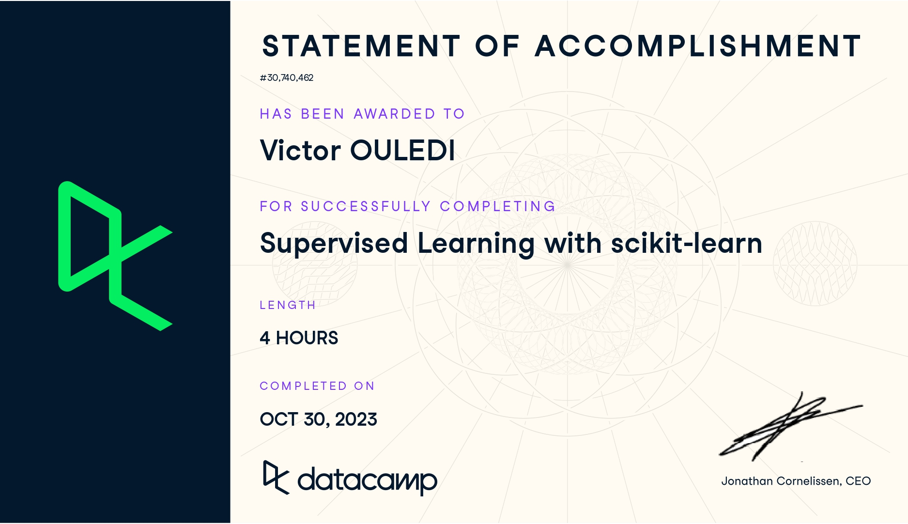
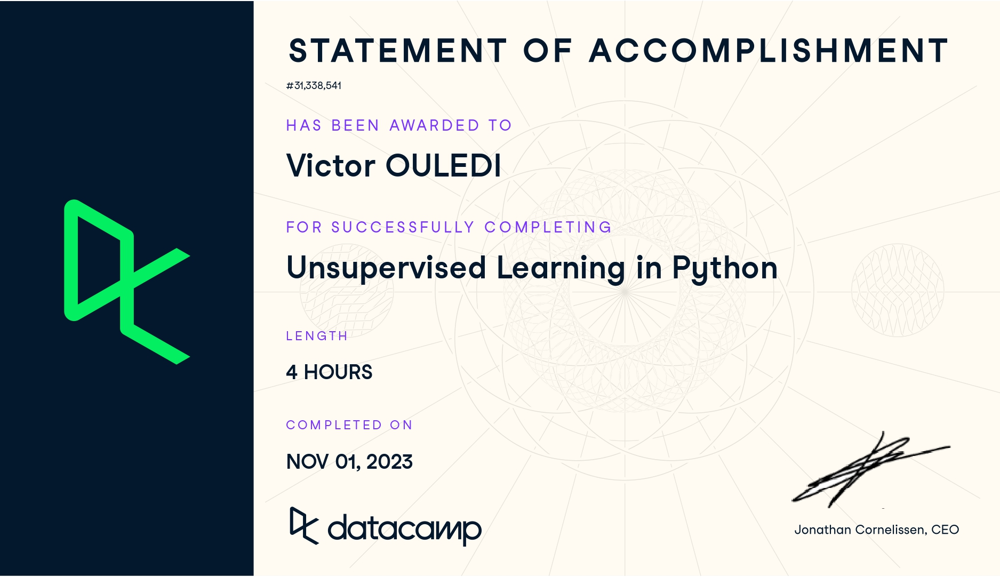
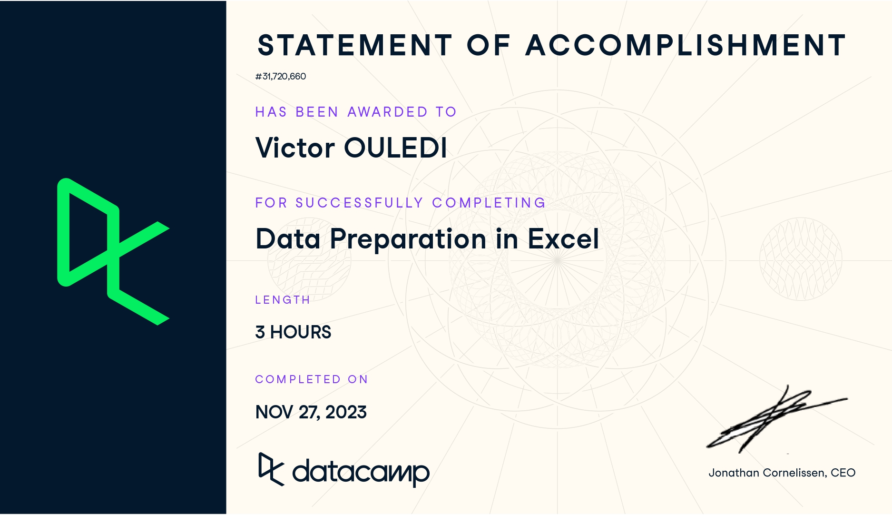
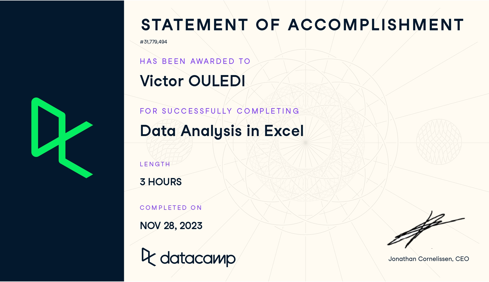

# Certifications data

## Certification SQL 

**Thèmes abordés par la certification :** joining data, data manipulation, PostgreSQL summary stats and window functions, functions for manipuation data in PostgreSQL, data analysis in SQL

## Certification Machine Learning with Python: supervised learning with scikit-learn

**Thèmes abordés par la certification :** using supervised techniques to build predictive models (for regression and classification problems), cross-validation, best parameters searching (Gridseach), model performance evaluation, hyper-parameter tuning, using pipelines.

## Certification Machine Learning with Python: unsupervised learning with Python (Scikit-Learn)

**Thèmes abordés par la certification :** clustering with K-means algorithm, data viz  with hierarchical clustering and t-SNE, dimensions reducition regarding principal component analysis (PCA), non-negative matrix factorization (NMF), building recommender systems with NMF

## Certification Data preparation with Excel 

**Thèmes abordés par la certification :** Functions for Data Preparation, conditional formulas, Lookups and data transformation.

## Certification Data analytics with Excel 

**Thèmes abordés par la certification :** PivotTables, Logical functions, What-if analysis, Forcasting.

