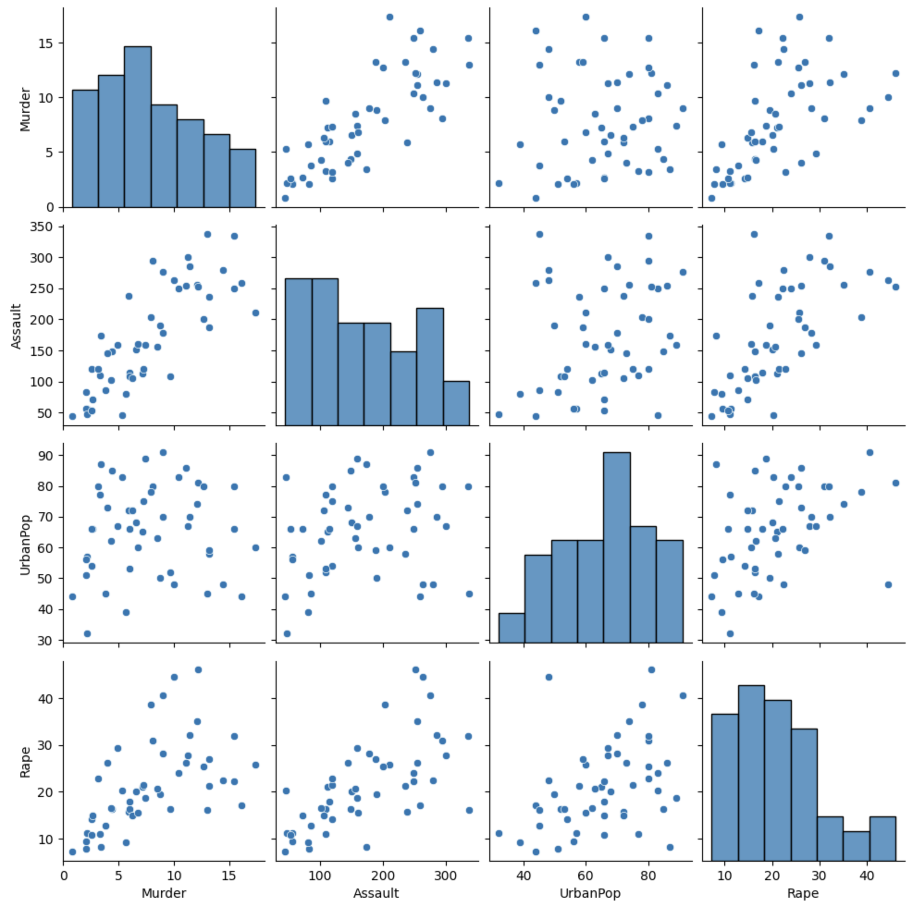
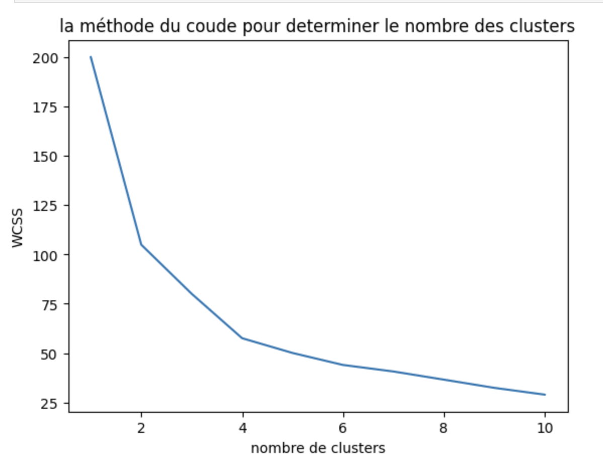
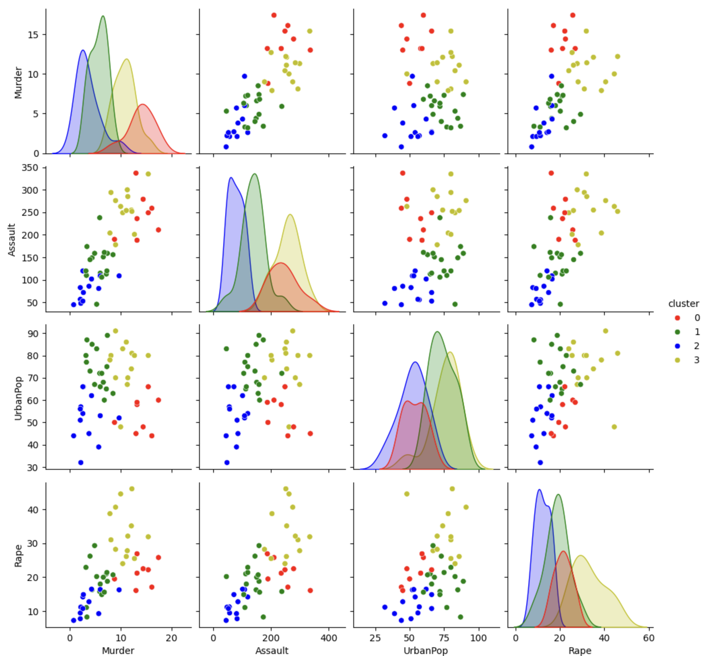
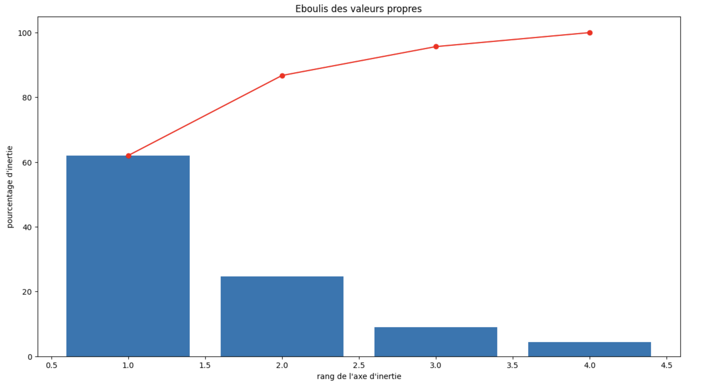
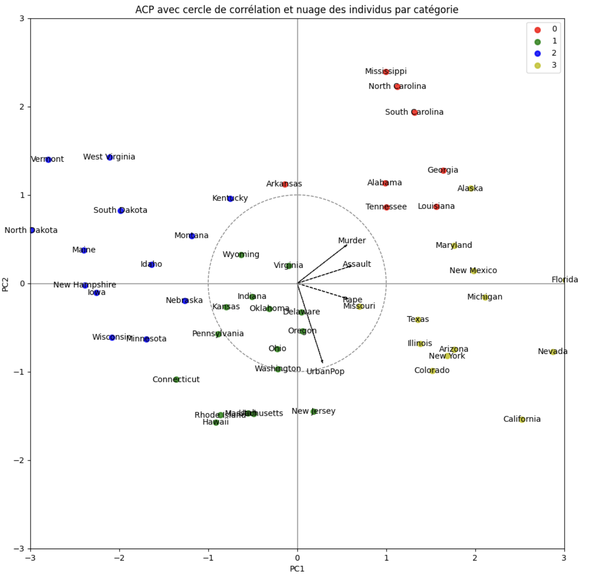

 

## Contexte & objectif
Ce travail a été effectué dans le cadre d’une auto-formation. La base comporte des observations pour les **50 États** des USA et **4 variables** :  
- **Murder** : taux de meurtres pour 100 000 hab.  
- **Assault** : agressions pour 100 000 hab.  
- **UrbanPop** : % de population urbaine.  
- **Rape** : taux de viols pour 100 000 hab.

Objectifs :  
1) **Clustering K-means** pour regrouper les États (nombre optimal ≈ **4**),  
2) **Réduction de dimension (ACP)** pour visualiser la structure et interpréter les axes.

## Stack & outillage
- **Python** : scikit-learn (KMeans, PCA), pandas, NumPy
- **Viz** : Seaborn, Matplotlib (inertie/coude, biplots), Plotly (interactif)
- **Qualité** : notebook propre, seeds fixés, export figures

## Code et quelques éléments de data vizualisation
La base de données est à retrouver [ici](../asset/Clustering_USA_crime/data/dataset_USA.csv). Le code qui a permi la réalisation du travail est à retrouver sous forme de jupyter notebook via ce [lien](https://github.com/Victorouledi/Portfolio_data_analyst_et_data_scientist_Victor_OULEDI/blob/a56bcd8e730e852f0ed5949ac902ec4b930507d5/docs/asset/Clustering_USA_crime/notebooks/crime_usa_clustering.ipynb).  

### Analyse des variables

### Détermination du nombre de clusters optimal

Ici on voit que le gain d'inertie ne devient plus significatif une fois atteint 4 clusters.

### Première visualisation des clusters sur différents plans relatifs à différentes combinaisons de 2 variables

### Nombre de composantes principales à garder pour la réduction de dimensions des données en fonction de la variabilité qu'elles expliquent pour ces-dernières

On observe qu'en conservant 2 composantes qui sont une combinaison linéaire des différents variables, on captures déjà près de 87 % de la variabilité des données. 

### Visualisation des individus et clusters suite à la réduction de dimension superposée au cercle de corrélation de l'ACP

Grâce à cette réduction de dimension il est ainsi possible de voir comment rapprocher ou distinguer les états et sur quels critères ces comparaisons peuvent être effectuées. 
