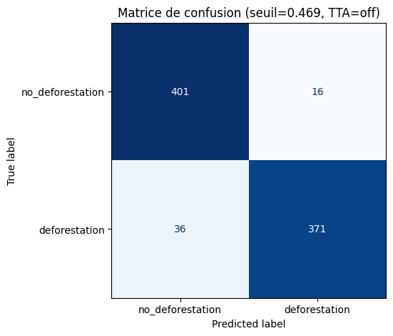

## Application Streamlit  
Application web interactive pour **détecter automatiquement la déforestation** à partir d’imageries satellite (type Sentinel-2).  
👉 [Ouvrir l’app](https://detectiondeforestationamazonie.streamlit.app/)

## Fonctionnalités principales
- 🌍 **Exploration cartographique** : carte satellite ESRI intégrée via **Folium**, zoomable et déplaçable.  
- 📍 **Import GeoJSON** : recentrage automatique de la carte sur une zone géographique donnée.  
- ⬛ **Sélection par rectangle** : l’utilisateur trace une *Bounding Box* (BBox) sur la carte pour définir la zone d’étude.  
- 📸 **Export PNG** : téléchargement automatique de la zone sélectionnée en image satellite haute résolution.  
- 🧠 **Inférence intégrée** : possibilité d’analyser directement le PNG exporté via le modèle de détection de déforestation.  
- ✅ **Résultats instantanés** : prédiction binaire (“déforestation” / “non déforestation”) avec probabilité associée.  
- 🧩 **Interface épurée** : design harmonisé (CSS custom Streamlit), affichage réactif sans espace blanc parasite sous la carte.  

> Le flux complet — de la sélection géographique jusqu’à la prédiction — s’exécute entièrement dans le navigateur Streamlit.

---

## Stack & outillage
- **Python** : TensorFlow/Keras (modèle ResNet50), NumPy, PIL, Requests  
- **Géospatial** : Folium, Mercantile (assemblage des tuiles satellite ESRI), GeoJSON  
- **App Web** : **Streamlit** + CSS personnalisé pour un rendu fluide  
- **Visualisation** : Matplotlib, affichage interactif des prédictions et des probabilités  
- **CI/CD** : déploiement via **Streamlit Cloud**  

---

## Données
- Patches satellite Sentinel-2 répartis en deux classes :  
  - `no_deforestation/` : zones forestières intactes  
  - `deforestation/` : zones dégradées ou ouvertes  
- **3 500 images d’entraînement** après nettoyage et augmentation.  
- Données prétraitées : redimensionnement, harmonisation des noms, séparation claire train/validation.

---

## Modèle & entraînement
Le modèle repose sur un **ResNet50 pré-entraîné sur ImageNet**, adapté pour la classification binaire.  
👉 [Voir le Notebook d'entrainement](../asset/app_detection_deforestation/deforestation_resnet_pipeline.ipynb)

**Pipeline simplifié :**
1. **Backbone ResNet50 gelé** au départ (extraction de caractéristiques visuelles générales).  
2. **Fine-tuning partiel** sur les derniers blocs pour spécialiser sur les motifs de déforestation.  
3. **Tête de classification** légère : *Global Average Pooling + Dropout + Dense(2, softmax)*.  
4. **Rééquilibrage de classes** par pondération du loss et sur-échantillonnage des patches minoritaires.  
5. **Data augmentation** : flips, rotations, zooms, translations pour renforcer la robustesse.  
6. **Test-Time Augmentation (TTA)** lors de l’inférence : moyenne des prédictions de plusieurs vues transformées.  

Le modèle est exporté en **TensorFlow Lite quantifié**, assurant des prédictions rapides et légères directement dans l’application.

---

## Performances (validation)

- **Précision / Rappel / F1-score** évalués sur un jeu de validation séparé.  
- Seuil ajusté pour optimiser le **F1-score** (meilleur compromis entre détection et faux positifs).  
- Excellente robustesse sur des zones jamais vues en entraînement (bonne généralisation spatiale).  

---

## Limites & pistes d’évolution
- 🛰️ **Enrichir les données** : étendre à d’autres régions (Afrique, Asie du Sud-Est) pour plus de diversité.  
- ⚙️ **Améliorer la résolution** : intégrer Sentinel-1 (radar) ou PlanetScope pour les cas nuageux.  
- 🧮 **Interprétabilité** : ajout d’un module **Grad-CAM** pour visualiser les zones qui influencent la décision.  
- 🌐 **API / batch mode** : permettre le traitement automatique de plusieurs zones via un endpoint.  
- 💾 **Historisation temporelle** : ajout d’un suivi multi-dates pour détecter l’évolution de la déforestation.  

---

> Projet complet alliant **vision par ordinateur**, **traitement géospatial**, et **démonstration web interactive**.  
> Il illustre la capacité à transformer un modèle d’IA en une **application accessible**, reproductible et déployée en ligne.

