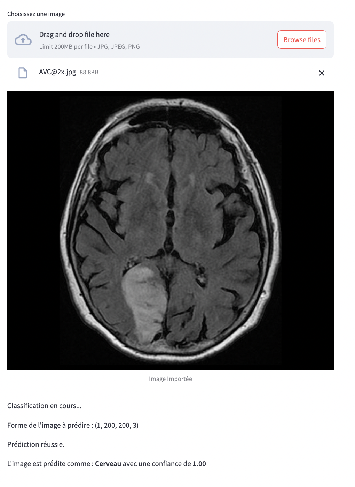
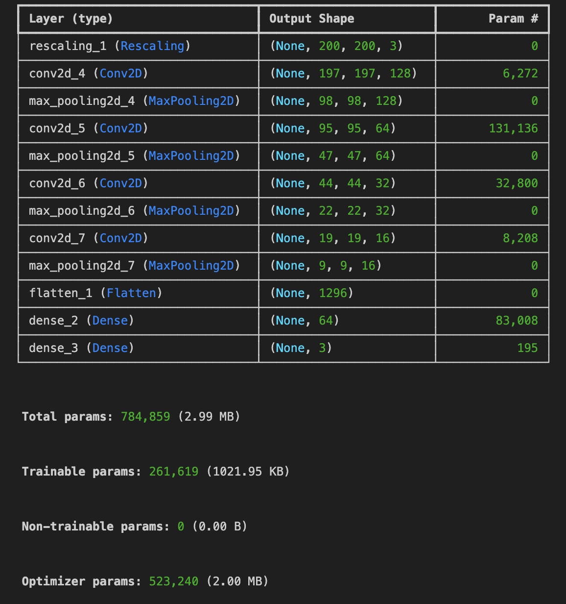
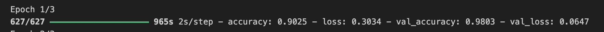

## Application Streamlit
Application web permettant d’uploader une image et de prédire **cerveau / poumon / autre**.  
👉 [Ouvrir l’app](https://cnnimageriesmedicales.streamlit.app/)

## Données
- **18 777 images** pour l’entraînement, **4 217** pour la validation.  
- Images issues de jeux publics (Kaggle) : IRM/scan (cerveau, poumon) + « autres » (visages, paysages, etc.).  
- Normalisation de la taille avant apprentissage.

## Modèle & entraînement
**CNN séquentiel** :
- Convolutions 2D **(128 → 64 → 32 → 16 filtres, noyau 4×4, ReLU)**  
- **MaxPooling** après chaque convolution  
- **Flatten**  
- **Dense(64, ReLU)**  
- **Dense(3, softmax)** pour les 3 classes  
- Entraînement initial sur **3 époques** (démo)

> Notebook : [Prédiction imagerie médicale (CNN)](../asset/Computer_vision/notebooks/Pre%CC%81diction%20imagerie%20me%CC%81dicale.ipynb)

## Stack & outillage
- **Python** : TensorFlow/Keras (CNN), scikit-image (prétraitements), OpenCV (I/O, transforms), (option) PyTorch
- **App** : **Streamlit** (démo web)
- **Viz** : Matplotlib/Seaborn ; (option) Grad-CAM pour interprétabilité
- **CI/CD** : GitHub Actions (build app/test), gestion d’artefacts (modèle)

## Performances (validation)

Les scores très élevés peuvent laisser penser à du **sur-apprentissage** : les images des sets train/val sont **peu diversifiées** (IRM très homogènes), ce qui facilite la généralisation *apparente*.

## Limites & pistes d’amélioration
- **Diversité & data augmentation** : flips/rotations, zoom, luminosité/contraste, légère coupe (keras `ImageDataGenerator` ou `tf.image`).  
- **Régularisation** : `Dropout`, **BatchNorm**, L2 (weight decay), **early stopping**.  
- **Transfer learning** : backbones **MobileNetV2**, **ResNet50**, **EfficientNet** (fine-tuning partiel).  
- **Évaluation** : vrai **jeu de test** séparé, matrice de confusion & métriques **par classe**.  
- **Interprétabilité** : **Grad-CAM** dans l’app pour visualiser les zones contributrices.  

