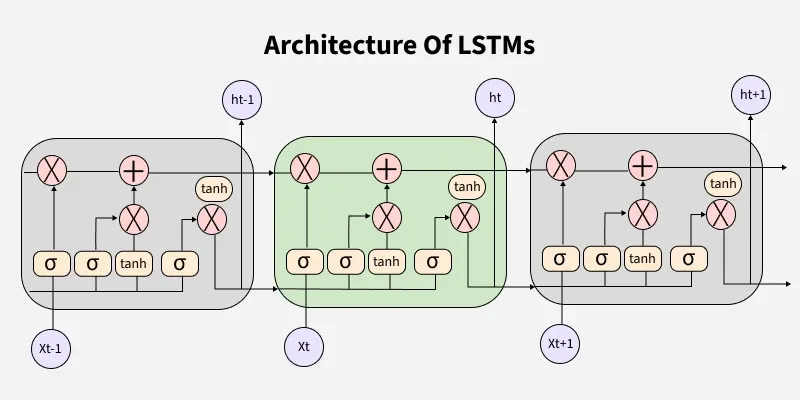
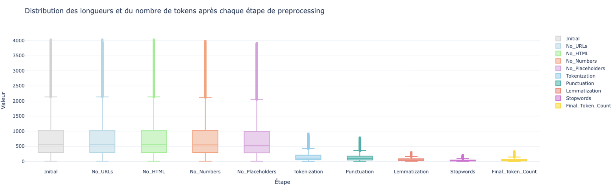
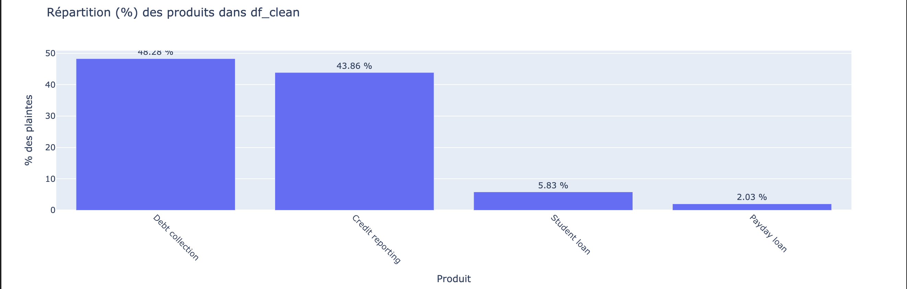
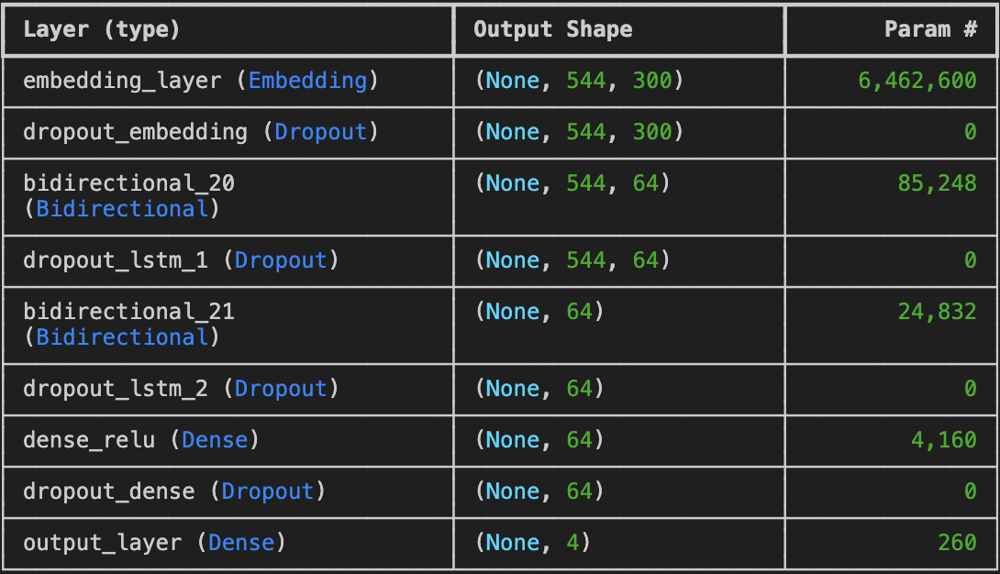
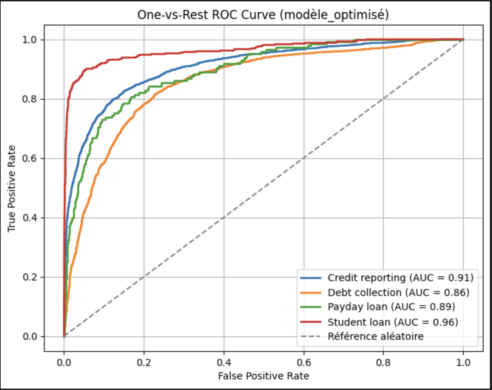
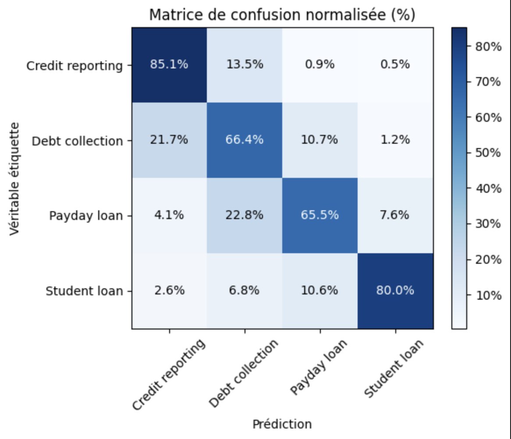

## Contexte & objectif
Classification automatique de **66 699 plaintes** clients du secteur financier en **4 catégories** : *Recouvrement de dettes*, *Rapports de crédit*, *Prêt étudiant*, *Prêt sur salaire*.  
Objectif : **prédire** la catégorie à partir du texte libre de la plainte.

- Dataset : [Consumer Complaint Database (Kaggle)](https://www.kaggle.com/datasets/selener/consumer-complaint-database)
- Notebook : [finance_complaints_NLP.ipynb](../asset/NLP_LSTM/notebooks/finance_complaints_NLP.ipynb)

 

## Pipeline de prétraitement
Nettoyage et normalisation des textes pour alimenter le modèle séquentiel :
- **Nettoyage** : suppression des URLs, nombres, ponctuation, placeholders.
- **Tokenisation & lemmatisation** ; suppression des **stopwords**.
- **Séquences** : **padding** à longueur fixe pour les batches.
- **Déséquilibre de classes** : **pondération des classes** et/ou rééquilibrage (sur/sous-échantillonnage) pour limiter le biais vers les classes majoritaires.

## Modèle & architecture
**BiLSTM** pour capter le contexte gauche↔droite :
- **Embedding (300d)** → représentation dense des tokens.  
- **2 × BiLSTM** → capture du contexte bidirectionnel (longues dépendances).  
- **Dense(64, ReLU)** → agrégation non linéaire.  
- **Sortie Softmax(4)** → probabilités par catégorie.  
- **Régularisation** : *Dropout* + L2, **class weights**.

**Stack** : Python, TensorFlow/Keras (BiLSTM), spaCy/NLTK (prétraitement), scikit-learn (métriques/rapport).

## Entraînement
- **Split** train/validation dédié.  
- **Early stopping** sur `val_loss` pour éviter le sur-apprentissage.  
- **Batchs** de séquences paddées ; **Adam** (lr adapté).  
- **Suivi** par classe : précision, rappel, F1.

## Résultats & métriques

Points clés :
- Bon compromis **rappel/précision** sur les classes majoritaires.  
- Les classes plus rares bénéficient de la **pondération** mais restent plus sensibles au seuil de décision.

## Limites & pistes d’amélioration
- **Données & classes** : étoffer les classes minoritaires ; équilibrage plus fin (focal loss).  
- **Modèle** : tester **GRU** ou **CNN + Attention**, embeddings pré-entraînés (GloVe, fastText).  
- **Interprétabilité** : mots/caractéristiques les plus contributifs (LIME/SHAP, attention plots).  
- **Produit** : export **SavedModel**, endpoint **FastAPI**, monitoring basique (trafic, dérive).

