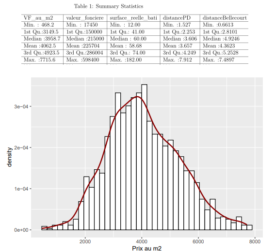
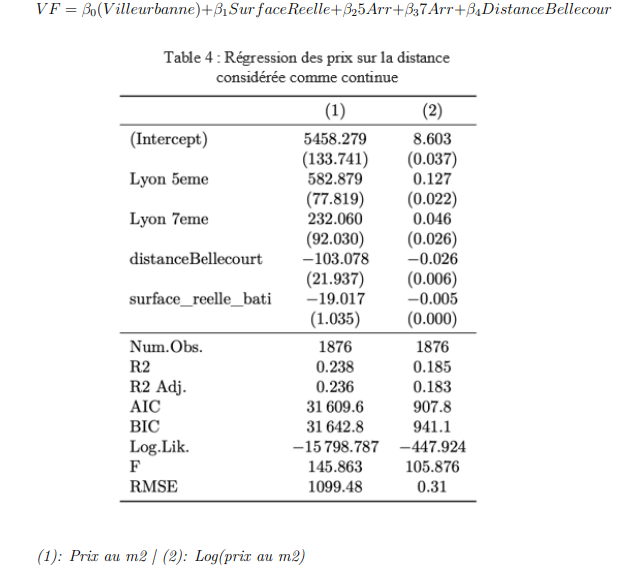

## Contexte & objectif
Analyse hédonique des **prix immobiliers** sur Lyon/Villeurbanne à partir de **données DVF** et sources ouvertes.  
Objectif : estimer l’impact des **caractéristiques du bien** (surface, pièces, type…), de l’**éloignement au centre-ville** et d’effets géographiques locaux (« prestige ») sur le **prix**.

- Données : DVF (open data) — [accès DVF](https://app.dvf.etalab.gouv.fr/)  
- Dossier projet : [ressources](https://github.com/Victorouledi/Portfolio_data_analyst_et_data_scientist_Victor_OULEDI/tree/portfolio/docs/asset/data_analysis_DVF/data) 
- Script RMarkdown : [COTT_cv.Rmd](https://github.com/Victorouledi/Portfolio_data_analyst_et_data_scientist_Victor_OULEDI/blob/portfolio/docs/asset/data_analysis_DVF/notebooks/COTT%20cv.rmd)

## Stack & outillage
- **R** : tidyverse (`dplyr`, `readr`, `tidyr`), **ggplot2**
- **Éco/Panel** : `fixest` / `plm`, `lmtest`, `sandwich`, `car`, `splines`
- **Tables** : `stargazer` / `modelsummary`, `broom`

## Données & variables
Plusieurs jeux combinés (DVF + enrichissements) : biens vendus, caractéristiques (surface, nb pièces/chambres, type), **localisation** (arrondissement/quartier), et **distance au centre**.  
Comparaison de zones : deux arrondissements (quartiers proches/éloignés) et deux quartiers de Villeurbanne.

### Voici quelques statistiques descriptives ainsi qu'un des modèles spécifiés tirés du projet
 
### Statisitiques descrives portant sur les valeurs d'intérets de la base de données utilisée

### Box plot des valeurs foncières dépendant des catégories de biens regroupés par nombre de pièces dont ils disposent

### Modèle statististique permettant de tester l'effet l'éloignement au centre sur le prix des biens en isolant les effets de "prestige des arrondissements"

