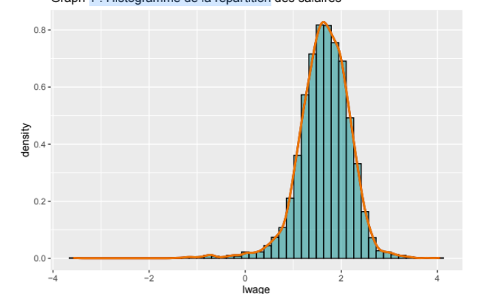
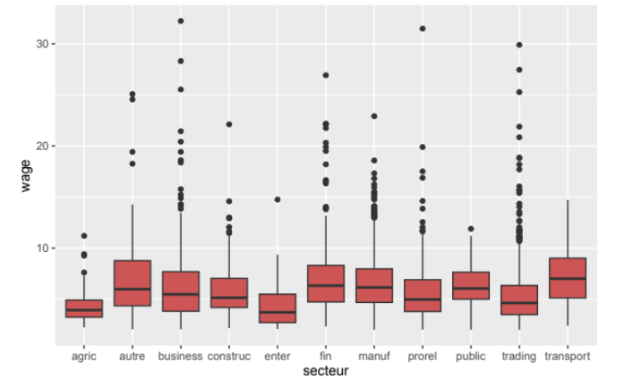
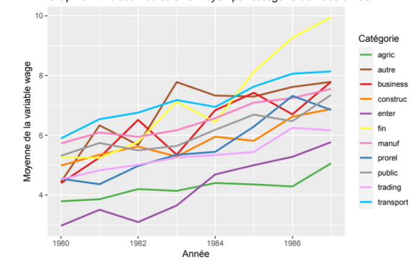
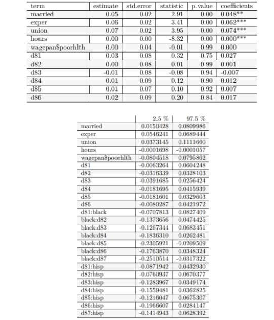

## Contexte & objectif
Analyse des **déterminants des salaires** sur données de **panel** (individus × années) issues de `wooldridge::wagepan`.  
Objectifs :
1) choisir une **spécification** crédible (FE/RE/FD) et un **estimateur** adapté,  
2) **identifier** les effets de variables **invariantes** (race/sex, etc.) malgré FE,  
3) évaluer la **robustesse** (tests & SE) et interpréter les **élasticités**.

- Notebook / Rmd : [code](https://github.com/Victorouledi/Portfolio_data_analyst_et_data_scientist_Victor_OULEDI/blob/portfolio/docs/asset/Panel_analysis_educ_USA/notebooks/3.Code%20en%20R%20pour%20la%20re%CC%81alisation%20de%20la%20mode%CC%81lisation%20statistique.rmd)

## Stack & outillage
- **R** : tidyverse, `plm` / `fixest` (FE/RE), `lmtest` (Hausman, BP), `sandwich` (HC/cluster), `car` (VIF)
- **Viz & tables** : ggplot2, `stargazer` / `modelsummary`

## Données & variables
Variables usuelles : `wage`, `educ`, `exper`, `tenure`, `union`, `married`, variables démographiques (invariantes), **année**.  
Cible recommandée : **`ln(wage)`** (stabilise la variance ; élasticités interprétables).

## Visualisations descriptives
### Distribution des salaires disponibles dans la base

### Box Plots des moyennes des salaires sur la période étudiée en fonction des catégories de métiers des individus présents dans la base

### Evolution des salaires moyens par secteurs d'activités sur la période étudiée

## Modèles estimés : Modèle Haussmann Taylor permettant d'attester des effets de régresseurs constants dans le temps dans le cadre d'une estimation within à effet fixe

