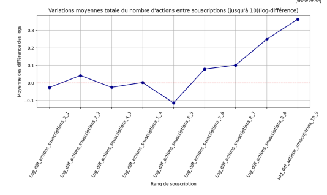
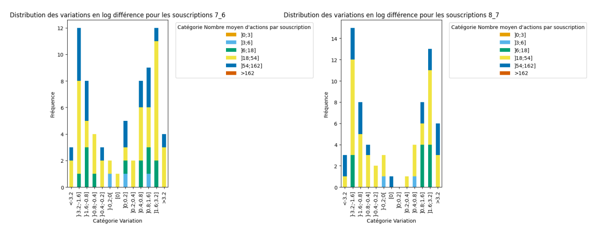
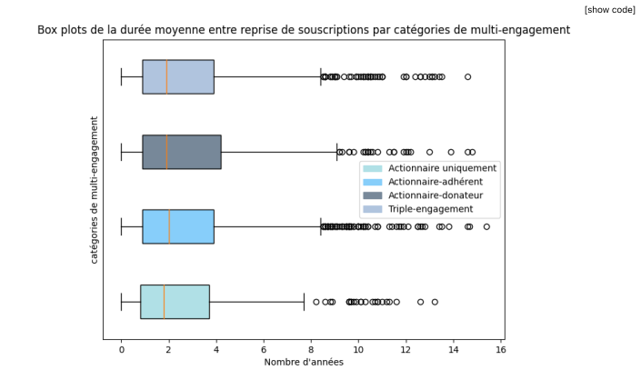
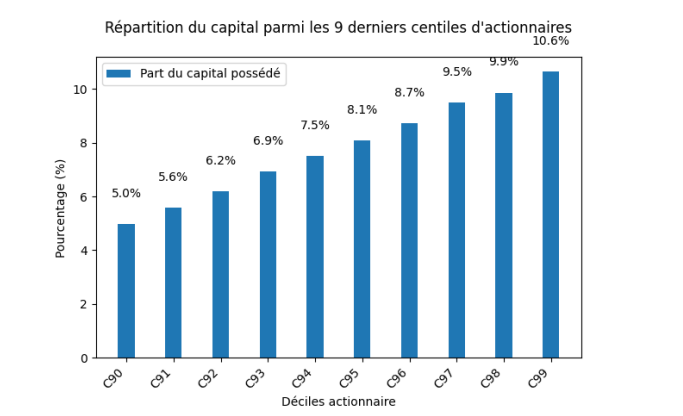

 
## Contexte & objectif
Analyse du **système d’actionnariat** de la foncière Terre de Liens pour mieux comprendre :
- **qui** sont les actionnaires (profils, montants, affectations),
- **comment** ils se comportent (rythme de souscription, **rachats**, récurrence),
- **où** concentrer l’effort (segments, rétention, concentration du capital).

> Base brute : **39 476 lignes**, **25 champs** (extrait Salesforce, version **fictive** reconstruite pour confidentialité).

- Notebook : [Jupyter_notebook_analyse_actionnariat.ipynb](../asset/data_analysis_TDL/notebooks/Jupyter_notebook_analyse_actionnariat.ipynb)

## Stack & outillage

- **Langage & notebooks** : Python, Jupyter (VS Code)
- **Data & préparation** : pandas, NumPy, nettoyage/normalisation, *feature engineering* (RFM, délais entre souscriptions), anonymisation/pseudonymisation
- **Stats & tests** : SciPy (tests χ²/Kruskal), Statsmodels (ANOVA/GLM), corrections FDR
- **Modélisation (optionnel selon analyses)** : scikit-learn (LogReg, KMeans/GMM, métriques), **lifelines** (Kaplan–Meier, Cox), XGBoost, SHAP (explicabilité)
- **Dataviz** : Matplotlib, Seaborn, Plotly (interactif)

## Quelques indicateurs extraits de l'analyse :**

### Analyse de la variation moyenne du nombre d'actions souscrites entre chaque rang de souscriptions prises

### Distribution des types de variations du nombre d'actions prises entre la septième et sixième  et entre la huitième et septième souscription

### Box plot des durée entre reprises de souscription en fonction des différents types d'actionnaires

### Répartition des parts du capital possédé parmi les 9 derniers centiles des actionnaires les plus riches

### Test Chi-2 et test post ANOVA pour définir la relation entre l'affectation des différentes souscriptions et le nombre moyens d'actions par souscription

